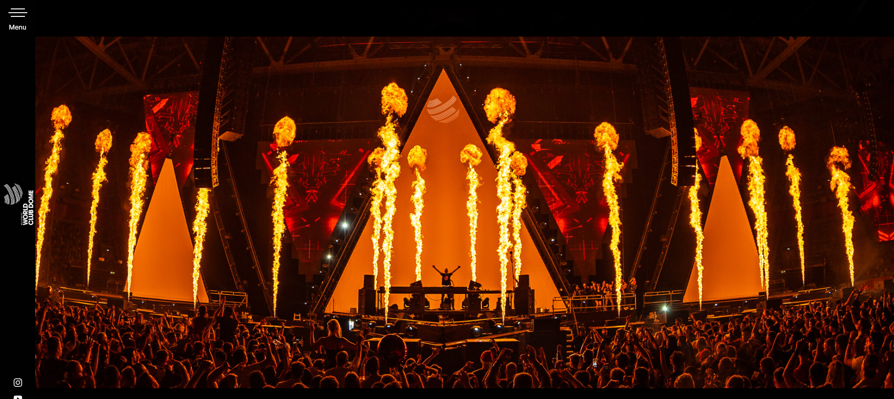

# Projet synthèse
## Les Darons
### James Oger
### Geoffrey Pastor
### Maxime Normandin Fortin

# 1. Analyse des besoins 
## Demande globale (dans vos mots/pas de copié-collé du devis)
Le client (festival) souhaite créer une image marque pour son site web et nous fait confiance sur la conception du site.

## Demandes spécifiques des clients (dans vos mots/pas de copié-collé du devis)
Ils veulent un logo qui représente bien leur festival.
### Besoins additionnels déterminés   
Page admin avec des sous-admin pour la modification ou l'annulation des forfaits.
## Demandes additionnelles (dans vos mots/pas de copié-collé du devis)
Le site doit pouvoir enregistrer les statistiques du nombre de pages vues avec Google Analytics.
### Besoins additionnels déterminés  

## Public cible
Les jeunes adultes qui aiment la musique Électro.
### Besoins additionnels déterminés  

# 2. Présentation du concept
## Nom du festival fictif
FestX
## Thème 
Électro
## Inspiration

    
https://www.echoesfromagartha.com/book-now/

    
Inspiration des forfaits
 
    

    
https://en.worldclubdome.com/

    
Inspiration pour le menu déroulant

    
Version fermer

    
    
Version Ouvert

    

## Identité visuelle
Neon Design sur fond sombre
### Le logo 

### La palette de couleurs
<table>
    <tr>
        <td>
            
#1DA5F3

            
        </td>
        <td>
            
#06162F

            
        </td>
    </tr>
</table>

### Les typographies

# 3. Choix technologiques 
## Choix des technologies de développement
Laravel
vue.js
Sourcetree
GitHub
## Forces
### Laravel
Laravel utilise le gestionnaire de dépendances Composer qui facilite l'ajout de packages tiers à notre projet. De plus il est livré avec un outil en ligne de commande appelé Artisan qui facilite la génération de code, la gestion de base de données et d'autres tâches courantes.
### Vue.js
Vue.js a une documentation complète très détaillée et bien entretenue.
Vue.js a une bonne réactivité basée sur la détection des changements pour mettre à jour automatiquement l'interface utilisateur en réponse aux modification des données.
### Sourcetree
Sourcetree est facile à utiliser, il est connu pour sa convivialité et son interface utilisateur intuitive.
Sourcetree offre une intégration transparente avec des services d'hébergement Git populaires comme par exemple GitHub.
### GitHub
GiHub facilite la collaboration entre les membres de notre équipe grâce à des fonctionnalités telles que les demandes de tirage (pull requests).
## Faiblesses
### Laravel
Laravel est régulièrement mis à jour pour améliorer les fonctionnalités et la sécurité, ce qui signigie que nous devons rester à jour avec les nouvelles versions et effectuer des mises à jour a notre projet existant.
### Vue.js
Vue.js a moins de solutions préconstruites, ce qui peut nécessiter plus de travail de développement personnalisé.
### Sourcetree
Sourcetree peut être gourmand en ressources système par rapport à la ligne de commande Git.
### GitHub
L'utilisation de GitHub signifie qu'on dépend d'un service tiers pour héberger notre code. Si GitHub venait à rencontrer des problèmes de disponiblité, cela pourrait affecter notre fulx de travail de développement.
## Choix et organisation des technologies de planification
Adobe XD
draw.io
## Forces
### Adobe XD
Adobe XD a une interface utilisateur intuitive qui est facile à prendre en main.
### draw.io
Draw.io prend en charge un large éventail de types de diagrammes, ce qui en fait un outil polyvalent pour la création de diverses visualisations, y compris des organigrammes, des diagrammes de flux, des cartes conceptuelles, des diagrammes UML, etc.
## Faiblesses
### Adobe XD
Adobe XD est principalement axé sur la conception d'interface utilisateur, ce qui signifie qu'il peut ne pas offrir autant de fonctionnalités pour la création de graphiques vectoriels complexes que des outils spécialisés comme Adobe Illustrator.
### draw.io  
Draw.io fonctionne principalement en linge. Il n'est pas idéal pour une utilisation hors ligne.  
## Choix et organisation des technologies de gestion
ClickUp
## Forces
On peux collaborer en temps réel sur les tâches, les documents et les commantaire, ce qui facilite la communication et la coordination.
## Faiblesses 
Bien que ClickUp propose une version gratuite, ses fonctionnalités les plus avancées et ses options de personnalisation nécessitent un abonnement payant.
# 4. Présentation de la planification du travail synthèse 
## Liens
### Lien vers le logiciel de gestion de projet choisi                    
## Portrait global 
### Catégories     
#### Sous-catégories       
## Apport au travail synthèse de chaque membre de l’équipe (qui fait quoi et quand ?)                        
## Rétroaction globale sur le travail d’équipe (motivation, charge de travail, organisation, problèmes, etc.)                        
